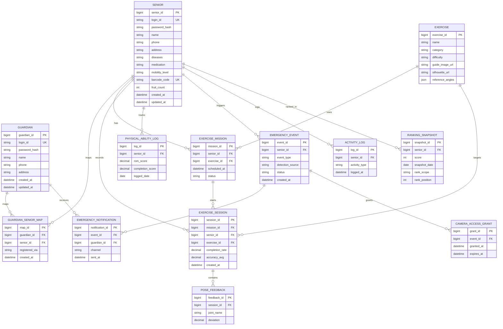

# 실버비전 (SilverVision)

노년 특화 Pose Estimation 모델을 활용한 치매 예방 스마트폰 홈 운동 플랫폼

2026 전기 졸업과제 · 팀 실버비전 (지도교수: 감진규)

---

## 목차

1. [프로젝트 배경](#1-프로젝트-배경)
2. [개발 목표](#2-개발-목표)
3. [시스템 설계](#3-시스템-설계)
4. [개발 결과](#4-개발-결과)
5. [설치 및 실행 방법](#5-설치-및-실행-방법)
6. [소개자료 및 시연 영상](#6-소개자료-및-시연-영상)
7. [팀 구성](#7-팀-구성)
8. [참고문헌](#8-참고문헌)

---

## 1. 프로젝트 배경

### 1.1 시장현황 및 문제점

2023년 치매역학조사 결과, 65세 이상 노인의 치매 유병률은 9.25%, 경도인지장애(MCI) 유병률은 28.42%에 달하며, 치매 환자 수는 2026년 100만 명을 초과할 것으로 추정됩니다. Lancet Commission 보고서는 신체적 비활동을 치매의 주요 수정 가능한 위험 요인 중 하나로 제시하며, 저강도 홈 트레이닝만으로도 인지기능의 임상적 향상이 확인된 바 있습니다.

기존 mHealth 운동 앱은 일반 성인 기준으로 설계되어 노년층 고유의 신체 특성(근감소증, 관절 가동 범위 제한 등)을 반영하지 못하며, 운동 중 이상 상황을 실시간으로 감지하고 대응하는 통합 솔루션은 부재한 상황입니다.

### 1.2 필요성과 기대효과

1. 60~80세 노년층이 자택에서 지속적으로 실천 가능한 맞춤형 홈 트레이닝 프로그램 제공
2. Computer Vision 기반 실시간 이상 행동 감지(낙상·무활동) 및 FCM 응급 알림 시스템 구축
3. BlazePose 기반 노년 특화 경량 분류기 개발을 통한 고령 친화적 AI 헬스케어 기술 개발 기여

## 2. 개발 목표

### 2.1 목표

실버비전은 Computer Vision 기술과 모바일 헬스(mHealth) 플랫폼을 융합하여, 60~80세 노년층의 치매 예방을 목적으로 한 스마트폰 기반 홈 트레이닝 및 응급 모니터링 시스템입니다. BlazePose 기반 경량 분류기를 활용한 노년 특화 자세 인식을 구현하고, 응급 알림 기능을 통합하여 별도의 웨어러블 장비 없이 스마트폰 단일 기기만으로 운동 지도와 안전 모니터링을 동시에 제공하는 것을 목표로 합니다.

**주요 기능**

- **시니어(피보호자)**: 회원가입/로그인, 운동 미션 및 알림, 실시간 자세 추정 및 운동 피드백(관절 각도 기반), 낙상·무활동 감지, 응급 확인 절차, 운동 완료 시 보상(나무/열매) 및 랭킹
- **보호자**: 다중 피보호자 등록 및 관리, 피보호자 활동 기록 조회(주간 활동량, 동작 완성도), 긴급 알림 수신 및 위치 확인, 이상 감지 기록 확인

### 2.2 기존 서비스 대비 차별성

| 비교 항목 | 일반 mHealth 운동 앱 | 실버비전 |
|---|---|---|
| 노년 특화 자세 인식 기준 | 일반 성인 기준 동작 인식 | BlazePose 기반, 노년 신체 특성(근감소증·관절 가동 범위 제한) 반영한 관절 각도 기준값(`reference_angles`) |
| 낙상 감지 | 미제공 | 온디바이스 관절 시계열 기반 실시간 낙상·무활동 감지(AI 파트, 별도 트랙) |
| 응급 대응 통합 | 별도 미제공(운동 기능과 분리) | 감지 → 1차 확인 → 보호자 알림(FCM) → 카메라 제한적 접근 → 상황 종료까지 하나의 상태 머신으로 통합 |
| 보호자 연동 | 미제공 또는 단순 공유 | 다중 피보호자 등록·관리, 활동·응급 이력 실시간 조회 |
| 별도 하드웨어 필요 여부 | 앱 단독(웨어러블 연동형도 존재) | 불필요(스마트폰 카메라만으로 자세 추정 + 응급 감지) |
| 보상/동기부여 체계 | 앱마다 상이 | 운동 완료 시 열매 보상 + 전국/지역 랭킹(게임화) |

### 2.3 사회적 가치

- 치매의 주요 수정 가능 위험 요인인 신체 비활동을 저강도 홈 트레이닝으로 완화해 고령층 인지기능 저하 예방에 기여
- 낙상·무활동 등 응급 상황을 보호자에게 즉시 연결해 독거·원거리 돌봄 상황의 안전 공백을 줄임
- 웨어러블 등 추가 장비 없이 스마트폰만으로 동작해 경제적 부담 없이 보급 가능
- 노년 특화 자세 추정 모델 개발을 통해 고령 친화적 AI 헬스케어 기술 저변 확대에 기여

## 3. 시스템 설계

### 3.1 기술 스택

| 영역 | 기술 | 버전 | 비고 |
|---|---|---|---|
| 프론트엔드 | Expo | ~54.0.35 | `frontend/package.json` 기준 |
| | React / React Native | 19.1.0 / 0.81.5 | |
| | TypeScript | ~5.9.2 (strict) | |
| | React Navigation (native / native-stack) | ^7.3.8 / ^7.17.10 | 단일 flat native-stack 네비게이터 |
| | @react-native-async-storage/async-storage | 2.2.0 | JWT access/refresh 토큰 저장 |
| | react-native-svg / expo-linear-gradient / lucide-react-native | 15.12.1 / ~15.0.8 / ^1.24.0 | UI 아이콘·그라디언트 |
| 백엔드 | Django | 6.0.7 | `backend/requirements.txt` 기준 |
| | djangorestframework | 3.17.1 | |
| | djangorestframework_simplejwt | 5.5.1 | 커스텀 인증 클래스(`RoleBasedJWTAuthentication`)와 함께 사용 |
| | MySQL / mysqlclient | 8.x / 2.2.8 | |
| | django-cors-headers | 4.9.0 | 개발 단계 CORS 전체 허용 |
| | python-dotenv | 1.2.2 | `.env` 시크릿 로드 |
| AI(자세 추정/응급 감지) | MediaPipe(BlazePose), TensorFlow, 1D-CNN 낙상 분류기 | — | **이 저장소 밖 별도 트랙에서 개발 중** — `frontend/`·`backend/` 코드에는 포함되지 않음 |
| 알림 | Firebase Cloud Messaging (FCM) | — | 백엔드는 `emergency_notification.channel`에 발송 채널·이력만 기록. **실제 FCM 발송 연동은 아직 미구현**(범위 밖) |

### 3.2 시스템 구성도

자세 추정 파이프라인은 `[카메라 프레임 획득] → [BlazePose Keypoint 추출] → [관절 각도 기반 운동 피드백]` 과 `[Keypoint 시계열 → 경량 분류기 → 낙상·무활동 감지]` 두 갈래로 분기되는 구조이며, 학습 데이터는 ETRI-Activity3D를 사용합니다.

전체 흐름은 다음과 같습니다.

- **프론트엔드(Expo/React Native)**가 카메라 프레임을 획득하고, AI 파트(별도 트랙)가 온디바이스에서 BlazePose 기반 관절 좌표를 추출해 (1) 운동 중에는 기준 각도(`reference_angles`) 대비 편차를 계산해 실시간 피드백을 주고, (2) 상시로는 낙상·무활동 여부를 분류합니다.
- 운동 결과(`completion_rate`/`accuracy_avg`/`pose_feedback`)와 응급 이벤트(`event_type`/`detection_source`)는 클라이언트가 계산까지 마친 값을 **백엔드(Django REST API)**로 전송하며, 백엔드는 이 값을 검증·저장·조회하는 역할만 담당합니다(AI 모델 경계).
- 응급 이벤트는 백엔드의 상태 머신(`detected → first_check → (false_alarm | notified) → resolved`)을 따라 전이되며, `notified` 상태가 되면 보호자 앱에 알림 레코드가 남고(FCM 실발송은 범위 밖), 제한 시간 동안 카메라 접근 권한(`camera_access_grant`)이 부여됩니다.
- 보호자 앱은 매핑된 피보호자의 프로필·운동 이력·응급 이력을 조회 전용으로 볼 수 있고, 시니어 본인만 자신의 데이터를 쓸 수 있습니다(IDOR 방지 권한 설계).

## 4. 개발 결과

### 4.1 DB ERD

`backend/DB_SCHEMA.md` 및 `backend/api/models.py` 기준, 13개 테이블입니다.



> `token_blacklist` 앱(simplejwt 로그아웃용)이 `OutstandingToken`/`BlacklistedToken` 테이블 2개를 추가로 관리하지만, 라이브러리 소유 테이블이라 위 ERD(13개 테이블)에는 포함하지 않았습니다.

### 4.2 기능 명세서 (API 엔드포인트)

`backend/api/urls.py` 기준 전체 **24개 엔드포인트**입니다(전부 `/api/v1/` 하위).

| 영역 | Method | 경로 | 설명 | 권한 |
|---|---|---|---|---|
| 인증 | POST | `auth/senior/register/` | 시니어 회원가입 | AllowAny |
| 인증 | POST | `auth/senior/login/` | 시니어 로그인 | AllowAny |
| 인증 | POST | `auth/guardian/register/` | 보호자 회원가입 | AllowAny |
| 인증 | POST | `auth/guardian/login/` | 보호자 로그인 | AllowAny |
| 인증 | POST | `auth/token/refresh/` | access token 재발급 | AllowAny |
| 인증 | POST | `auth/logout/` | refresh token 무효화(blacklist) | AllowAny |
| 계정 | GET·PUT·PATCH | `senior/{senior_id}/` | 시니어 프로필 조회/수정 | GET: 본인·매핑된 보호자 / 쓰기: 본인 |
| 계정 | GET·PUT·PATCH | `guardian/{guardian_id}/` | 보호자 프로필 조회/수정 | 본인 |
| 계정 | GET·POST | `guardian/{guardian_id}/seniors/` | 매핑 목록 조회 / 피보호자 등록 | 본인 |
| 계정 | DELETE | `guardian/{guardian_id}/seniors/{senior_id}/` | 매핑 해제 | 본인 |
| 운동 | GET | `exercises/`, `exercises/{exercise_id}/` | 운동 콘텐츠 목록/상세 | 로그인 사용자 |
| 운동 | GET·POST | `senior/{senior_id}/missions/` | 운동 미션 목록/생성 | 본인 |
| 운동 | PATCH | `senior/{senior_id}/missions/{mission_id}/` | 미션 상태 변경 | 본인 |
| 기록 | GET·POST | `senior/{senior_id}/sessions/` | 운동 세션 목록 / 시작 | GET: 본인·매핑된 보호자 / POST: 본인 |
| 기록 | GET·PATCH | `senior/{senior_id}/sessions/{session_id}/` | 세션 상세(피드백 nested) / 완료 처리 | GET: 본인·매핑된 보호자 / PATCH: 본인 |
| 기록 | POST | `senior/{senior_id}/sessions/{session_id}/feedback/` | 관절 피드백 저장(bulk) | 본인 |
| 기록 | GET·POST | `senior/{senior_id}/activity-log/` | 기기 활동 로그 조회/기록 | GET: 본인·매핑된 보호자 / POST: 본인 |
| 기록 | GET·POST | `senior/{senior_id}/ability-log/` | 장기 신체 능력(일별) 조회/upsert | 본인 |
| 응급 | GET·POST | `emergency/` | 응급 이벤트 목록 조회 / 생성 | GET: 본인·매핑된 보호자 / POST: 본인 |
| 응급 | GET·PATCH | `emergency/{event_id}/` | 이벤트 상세(알림·카메라권한 nested) / 상태 전이 | 본인·매핑된 보호자 |
| 응급 | POST | `emergency/{event_id}/notify/` | 보호자 알림 레코드 생성 | 본인·매핑된 보호자 |
| 응급 | POST·DELETE | `emergency/{event_id}/camera-grant/` | 카메라 접근 권한 부여/즉시 만료 | 본인·매핑된 보호자 |
| 게임화 | GET | `senior/{senior_id}/ranking/` | 전국/지역 최신 랭킹 스냅샷 조회 | 본인 |

**미구현(계획됨)**: 비밀번호 변경/재설정, 매핑 등록 전 시니어 검색 API. 그 외 스키마 13개 테이블에 직결되는 CRUD는 전부 구현·테스트 완료(`backend/api/tests.py` 82건 통과).

### 4.3 디렉토리 구조

```
silvervision/
├── AGENTS.md              # 모노레포 루트 Claude Code 참고 문서
├── CLAUDE.md               # 루트 AGENTS.md를 포함한 Claude Code 진입 문서
├── CONTRIBUTING.md         # 전체 협업 가이드
├── README.md
├── backend/                 # Django REST API 서버
│   ├── AGENTS.md
│   ├── DB_SCHEMA.md         # 13개 테이블 스키마 문서
│   ├── claude-security-guidance.md
│   ├── api/                 # models.py / views.py / serializers.py / urls.py / permissions.py / authentication.py 등
│   ├── config/               # Django 프로젝트 설정 (settings.py, config/urls.py)
│   ├── manage.py
│   └── requirements.txt
└── frontend/                 # Expo(React Native) 앱
    ├── AGENTS.md
    ├── App.tsx               # 진입점: SafeAreaProvider → AppStateProvider → NavigationContainer
    ├── app.json
    ├── assets/
    ├── src/
    │   ├── api/client.ts      # 공통 API 클라이언트(fetch 래퍼, JWT 저장/첨부)
    │   ├── context/AppStateContext.tsx
    │   ├── navigation/types.ts
    │   ├── screens/            # common/ senior/ guardian/ — 4.4절 참고
    │   ├── theme/theme.ts
    │   └── types/
    └── tsconfig.json
```

### 4.4 프론트엔드 화면 목록

`frontend/src/screens/{common,senior,guardian}/` 기준 17개 화면이며, **전 화면 실제 백엔드 API 연동 완료** 상태입니다.

| 구분 | 화면 | API 연동 | 비고 |
|---|---|---|---|
| 공통 | EntryScreen | 해당 없음 | 역할 선택 진입 화면(조회 대상 없음) |
| 공통 | LoginScreen | ✅ 완료 | 시니어 로그인 + 프로필 조회 |
| 시니어 | SignupScreen | ✅ 완료 | 회원가입 → 즉시 로그인 |
| 시니어 | SeniorHomeScreen | ✅ 완료 | 프로필 + 랭킹 조회 |
| 시니어 | ExerciseSelectScreen | ✅ 완료 | 운동 목록 조회 |
| 시니어 | ExerciseProgressScreen | ✅ 완료 | 미션 생성 → 세션 시작. `completion_rate` 등은 `// TODO(vision)` 임시값(비전 연동 대기) |
| 시니어 | ExerciseFeedbackScreen | ✅ 완료 | 세션 완료 PATCH + 피드백 POST. `PLACEHOLDER_POSE_FEEDBACK`은 `// TODO(vision)` 임시값(비전 연동 대기) |
| 시니어 | ProfileScreen | ✅ 완료 | 프로필 조회/수정 |
| 보호자 | GuardianLoginScreen | ✅ 완료 | 보호자 로그인 + 프로필 조회 |
| 보호자 | GuardianSignupScreen | ✅ 완료 | 회원가입 → 즉시 로그인 |
| 보호자 | GuardianHomeScreen | ✅ 완료 | 피보호자 목록 조회 |
| 보호자 | AddSeniorScreen | ✅ 완료 | 피보호자 조회+등록 |
| 보호자 | SeniorDetailScreen | ✅ 완료 | 프로필/세션/운동/응급 병렬 조회, 매핑 해제 |
| 보호자 | GuardianActivityListScreen | ✅ 완료 | 피보호자별 대시보드 집계 |
| 보호자 | AlertHistoryScreen | ✅ 완료 | 응급 이벤트 목록 조회 |
| 보호자 | AlertDetailScreen | ✅ 완료 | 응급 상세 조회 + 상태 전이(PATCH). 상세 분석 타임라인(`TIMELINE`)은 비전팀 몫이라 목업 유지 |
| 보호자 | GuardianProfileScreen | ✅ 완료 | 프로필 조회/수정, 피보호자 목록 |

> `VoiceAssistantModal`은 화면 목록(17개)에 포함되지 않은 별도 컴포넌트로, 음성 인식 기능 설계가 미확정이라 포팅만 완료된 채 미마운트 상태입니다.

## 5. 설치 및 실행 방법

### 5.1 백엔드 (`backend/`)

```bash
cd backend
python -m venv venv
.\venv\Scripts\Activate.ps1      # Windows
source venv/bin/activate          # macOS/Linux
pip install -r requirements.txt

# .env.example을 참고해 .env를 로컬에 생성 (SECRET_KEY/DB_NAME/DB_USER/DB_PASSWORD/DB_HOST/DB_PORT)
# .env는 git에 커밋하지 않는다. MySQL 8.x가 로컬에 떠 있어야 하며 DB_SCHEMA.md 기준으로 DB/계정을 만든다

python manage.py migrate
python manage.py runserver        # http://localhost:8000, API는 /api/v1/, admin은 /admin/
```

검증용 명령:

```bash
python manage.py check                       # 시스템 체크
python manage.py makemigrations --check       # 누락된 마이그레이션 확인
python manage.py test api                     # 전체 테스트 (82건)
```

운동 콘텐츠(`Exercise`) 등 마스터 데이터 시드는 없으므로 `/admin/`에서 직접 등록하기 전까지 `GET /exercises/`는 빈 배열을 반환합니다.

### 5.2 프론트엔드 (`frontend/`)

```bash
cd frontend
npm install

# .env.example을 .env로 복사 (EXPO_PUBLIC_API_BASE_URL — 미설정 시 http://localhost:8000/api/v1 로 폴백)
# 실기기(Expo Go)로 테스트할 땐 localhost 대신 개발 PC의 LAN IP(예: 192.168.x.x)를 넣어야 폰에서 백엔드에 접속 가능하다
# .env는 git에 커밋하지 않는다

npx expo start          # Metro 개발 서버 — 터미널에서 android/ios/web 선택
npx expo start --web    # 크롬 프리뷰
npx tsc --noEmit        # strict TypeScript 타입 체크
```

### 5.3 흔한 오류

- **`.gitignore`/`requirements.txt` 인코딩 문제**: 이 저장소에서 실제로 `.gitignore`가 UTF-16으로 저장되어 `.claude/` 등 패턴이 정상적으로 무시되지 않은 적이 있습니다(`fix/gitignore-encoding`). 텍스트 설정 파일은 UTF-8로 저장하세요. `requirements.txt`는 현재도 UTF-16이므로 편집 시 인코딩을 유지해야 합니다.
- **MySQL 미기동**: 로컬 MySQL 8.x 서비스가 떠 있지 않으면 `migrate`/`runserver`/`test` 모두 DB 연결 오류로 실패합니다. `.env`의 `DB_HOST`/`DB_PORT`가 실제 MySQL 인스턴스를 가리키는지, 서비스가 기동되어 있는지 먼저 확인하세요.

## 6. 소개자료 및 시연 영상

추후 추가 예정

## 7. 팀 구성

팀명: 실버비전 · 지도교수: 감진규

| 이름 | 이메일 | 주요 역할 | 세부 담당 |
|---|---|---|---|
| 강서영 | (추후 기재) | 백엔드 개발 + API 통합 | Django/DRF 기반 REST API 24개 엔드포인트 설계·구현, MySQL DB 스키마 13개 테이블 설계, JWT 인증(`RoleBasedJWTAuthentication`) 및 IDOR 방지 권한 설계, 응급 이벤트 상태 머신 구현 |
| 박소영 | (추후 기재) | 프론트엔드 개발 + UI/UX 설계 | Expo(React Native)+TypeScript 기반 화면 17개 구현, 시니어/보호자 UX 분리 설계(4자리 PIN vs 일반 비밀번호 등 접근성 고려), 노년 특화 모델용 Keypoint 추출·데이터 라벨링 지원 |
| 주은택 | (추후 기재) | AI/비전 모듈 개발 (Pose Estimation) | MediaPipe 기반 관절 좌표 추출, 1D-CNN 낙상 분류 모델 설계 — **이 저장소 밖 별도 트랙에서 개발 진행 중** |

> **역할 변경 이력**: 착수보고서 원안에는 강서영이 AI 모델(낙상 감지 알고리즘)도 겸임하는 것으로, 주은택은 "백엔드 + AI 모델" 공동 담당으로 명시되어 있었습니다. 중간보고서 단계에서 비전(Computer Vision) 파트를 주은택이 전담하는 것으로 역할이 재조정되었고, 이후 AI 모델(자세 추정·낙상 감지) 개발은 `frontend/`·`backend/` 코드베이스 밖에서 별도로 진행됩니다.

## 8. 참고문헌

프로젝트의 배경이 된 주요 참고문헌(치매역학조사, Lancet Commission 보고서, ETRI-Activity3D 등)은 착수보고서를 참고하세요.
