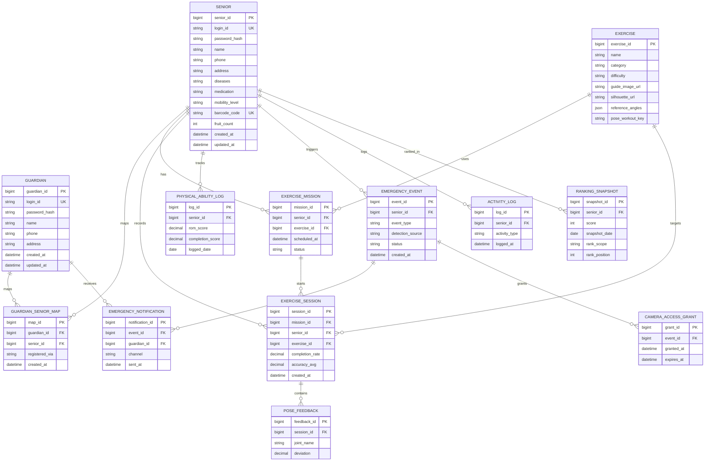

# 실버비전 (SilverVision)

노년 특화 Pose Estimation 모델을 활용한 치매 예방 스마트폰 홈 운동 플랫폼

2026 전기 졸업과제 · 팀 실버비전 (지도교수: 감진규)

---

## 목차

1. [프로젝트 배경](#1-프로젝트-배경)
2. [개발 목표](#2-개발-목표)
3. [시스템 설계](#3-시스템-설계)
4. [개발 결과](#4-개발-결과)
5. [설치 및 실행 방법](#5-설치-및-실행-방법)
6. [소개자료 및 시연 영상](#6-소개자료-및-시연-영상)
7. [팀 구성](#7-팀-구성)
8. [참고문헌](#8-참고문헌)

---

## 1. 프로젝트 배경

### 1.1 시장현황 및 문제점

2023년 치매역학조사 결과, 65세 이상 노인의 치매 유병률은 9.25%, 경도인지장애(MCI) 유병률은 28.42%에 달하며, 치매 환자 수는 2026년 100만 명을 초과할 것으로 추정됩니다. Lancet Commission 보고서는 신체적 비활동을 치매의 주요 수정 가능한 위험 요인 중 하나로 제시하며, 저강도 홈 트레이닝만으로도 인지기능의 임상적 향상이 확인된 바 있습니다.

기존 mHealth 운동 앱은 일반 성인 기준으로 설계되어 노년층 고유의 신체 특성(근감소증, 관절 가동 범위 제한 등)을 반영하지 못하며, 운동 중 이상 상황을 실시간으로 감지하고 대응하는 통합 솔루션은 부재한 상황입니다.

### 1.2 필요성과 기대효과

1. 60~80세 노년층이 자택에서 지속적으로 실천 가능한 맞춤형 홈 트레이닝 프로그램 제공
2. Computer Vision 기반 실시간 이상 행동 감지(낙상·무활동) 및 FCM 응급 알림 시스템 구축
3. BlazePose 기반 노년 특화 경량 분류기 개발을 통한 고령 친화적 AI 헬스케어 기술 개발 기여

## 2. 개발 목표

### 2.1 목표

실버비전은 Computer Vision 기술과 모바일 헬스(mHealth) 플랫폼을 융합하여, 60~80세 노년층의 치매 예방을 목적으로 한 스마트폰 기반 홈 트레이닝 및 응급 모니터링 시스템입니다. BlazePose 기반 경량 분류기를 활용한 노년 특화 자세 인식을 구현하고, 응급 알림 기능을 통합하여 별도의 웨어러블 장비 없이 스마트폰 단일 기기만으로 운동 지도와 안전 모니터링을 동시에 제공하는 것을 목표로 합니다.

**주요 기능**

- **시니어(피보호자)**: 회원가입/로그인, 운동 미션 및 알림, 실시간 자세 추정 및 운동 피드백(관절 각도 기반), 낙상·무활동 감지, 응급 확인 절차, 운동 완료 시 보상(나무/열매) 및 랭킹
- **보호자**: 다중 피보호자 등록 및 관리, 피보호자 활동 기록 조회(주간 활동량, 동작 완성도), 긴급 알림 수신 및 위치 확인, 이상 감지 기록 확인

### 2.2 기존 서비스 대비 차별성

| 비교 항목 | 일반 mHealth 운동 앱 | 실버비전 |
|---|---|---|
| 노년 특화 자세 인식 기준 | 일반 성인 기준 동작 인식 | BlazePose 기반, 노년 신체 특성(근감소증·관절 가동 범위 제한) 반영한 관절 각도 기준값(`reference_angles`) |
| 낙상 감지 | 미제공 | 온디바이스 관절 시계열 → 경량 1D-CNN(`fall_cnn_quant.tflite`) 실시간 낙상 감지 + 무활동 감지. 판정 로직이 앱(`frontend/src/pose/fall/`)에 내장돼 직접 동작 |
| 응급 대응 통합 | 별도 미제공(운동 기능과 분리) | 감지 → 1차 확인 → 보호자 알림(FCM) → 카메라 제한적 접근 → 상황 종료까지 하나의 상태 머신으로 통합 |
| 보호자 연동 | 미제공 또는 단순 공유 | 다중 피보호자 등록·관리, 활동·응급 이력 실시간 조회 |
| 별도 하드웨어 필요 여부 | 앱 단독(웨어러블 연동형도 존재) | 불필요(스마트폰 카메라만으로 자세 추정 + 응급 감지) |
| 보상/동기부여 체계 | 앱마다 상이 | 운동 완료 시 열매 보상 + 전국/지역 랭킹(게임화) |

### 2.3 사회적 가치

- 치매의 주요 수정 가능 위험 요인인 신체 비활동을 저강도 홈 트레이닝으로 완화해 고령층 인지기능 저하 예방에 기여
- 낙상·무활동 등 응급 상황을 보호자에게 즉시 연결해 독거·원거리 돌봄 상황의 안전 공백을 줄임
- 웨어러블 등 추가 장비 없이 스마트폰만으로 동작해 경제적 부담 없이 보급 가능
- 노년 특화 자세 추정 모델 개발을 통해 고령 친화적 AI 헬스케어 기술 저변 확대에 기여

## 3. 시스템 설계

### 3.1 기술 스택

| 영역 | 기술 | 버전 | 비고 |
|---|---|---|---|
| 프론트엔드 | Expo | ~55.0.24 | `frontend/package.json` 기준. 카메라 네이티브 모듈 때문에 Expo Go 불가 → 개발 빌드 필요 |
| | React / React Native | 19.2.0 / 0.83.10 | |
| | TypeScript | ~5.9.2 (strict) | |
| | React Navigation (native / native-stack) | ^7.3.8 / ^7.17.10 | 단일 flat native-stack 네비게이터 |
| | @react-native-async-storage/async-storage | 2.2.0 | JWT access/refresh 토큰 저장 |
| | react-native-svg / expo-linear-gradient / lucide-react-native | 15.15.3 / ~55.0.16 / ^1.24.0 | UI 아이콘·그라디언트 |
| | react-native-vision-camera / react-native-fast-tflite / react-native-reanimated / react-native-worklets · -core | ^4.7.2 / ^3.0.1 / 4.2.1 / 0.7.4 · ^1.6.3 | 카메라 프레임 프로세서 파이프라인 — `vision-camera` 프레임 → 커스텀 네이티브 플러그인(`plugins/native/PoseDetectorPlugin.kt` + MediaPipe PoseLandmarker, 모델 `pose_landmarker_lite.task`) 33개 관절 추출 → `fast-tflite`가 `assets/models/fall_cnn_quant.tflite`로 낙상 분류. `reanimated`+`worklets-core`는 프레임 프로세서 워클릿·오버레이용. 전부 네이티브 모듈이라 Expo Go·웹 불가(`expo-dev-client ~55.0.37`로 개발 빌드) |
| 백엔드 | Django | 6.0.7 | `backend/requirements.txt` 기준 |
| | djangorestframework | 3.17.1 | |
| | djangorestframework_simplejwt | 5.5.1 | 커스텀 인증 클래스(`RoleBasedJWTAuthentication`)와 함께 사용 |
| | MySQL / mysqlclient | 8.x / 2.2.8 | |
| | django-cors-headers | 4.9.0 | 개발 단계 CORS 전체 허용 |
| | python-dotenv | 1.2.2 | `.env` 시크릿 로드 |
| AI · 비전 (앱 내장) | MediaPipe PoseLandmarker(BlazePose 계열) + 1D-CNN 낙상 분류기(`.tflite`) | — | **이번 vision 통합으로 `frontend/src/pose/`에 편입됨.** `plugins/native/`의 네이티브 프레임 프로세서가 관절 좌표를 추출하고, `src/pose/exercise/`가 포즈 시퀀스 매칭, `src/pose/fall/`이 `fall_cnn_quant.tflite`로 낙상 분류. `VideoTensor` 프로토타입에서 실기기 검증을 마친 판정 로직을 사람이 직접 포팅한 것(절차: `frontend/docs/ASSEMBLY.md`) |
| AI 모델 학습 (저장소 밖) | BlazePose 파인튜닝, CNN 학습 (ETRI-Activity3D) | — | 모델 **학습·추론 개발 자체**는 여전히 이 저장소 밖 `VideoTensor` 트랙. 학습 산출물(`.task`/`.tflite`)만 위 통합 코드가 로드한다 |
| 알림 | Firebase Cloud Messaging (FCM) | — | 백엔드는 `emergency_notification.channel`에 발송 채널·이력만 기록. **실제 FCM 발송 연동은 아직 미구현**(범위 밖) |

### 3.2 시스템 구성도

자세 추정 파이프라인은 `[카메라 프레임 획득] → [MediaPipe PoseLandmarker Keypoint 추출] → [관절 각도 계산 → 기준 포즈 시퀀스 매칭]` 과 `[Keypoint 시계열 → 경량 1D-CNN → 낙상·무활동 감지]` 두 갈래로 분기되는 구조이며, 모델 학습 데이터는 ETRI-Activity3D를 사용합니다. 관절 추출부터 두 갈래의 판정까지가 이번 vision 통합으로 앱(`frontend/src/pose/`, `frontend/plugins/native/`)에 들어왔고, 모델 학습·추론 개발만 별도 `VideoTensor` 트랙에 남아 있습니다.

전체 흐름은 다음과 같습니다.

- **프론트엔드(Expo/React Native)**가 카메라 프레임을 획득하고, 온디바이스 네이티브 프레임 프로세서(`react-native-vision-camera` + MediaPipe PoseLandmarker, `frontend/plugins/native/`)가 33개 관절 좌표를 추출합니다. 그 좌표를 `frontend/src/pose/`의 판정 로직이 받아 (1) 운동 중에는 기준 포즈 시퀀스(`WORKOUT_POSE_SEQUENCES`)와 매칭해 단계 진행을 집계하고, (2) 상시로는 `fall_cnn_quant.tflite`로 낙상 여부를 분류합니다. (BlazePose 모델·CNN 학습 자체는 별도 트랙.)
- 운동 결과(`completion_rate`/`accuracy_avg`)와 응급 이벤트(`event_type`/`detection_source`)는 클라이언트가 계산까지 마친 값을 **백엔드(Django REST API)**로 전송하며, 백엔드는 이 값을 검증·저장·조회하는 역할만 담당합니다(AI 모델 경계). 관절별 편차(`pose_feedback`)는 현재 포즈 매처가 통과/실패만 반환해 실측값이 없어 프론트에서 전송하지 않습니다(엔드포인트는 대기 상태로 보존).
- 응급 이벤트는 백엔드의 상태 머신(`detected → first_check → (false_alarm | notified) → resolved`)을 따라 전이되며, `notified` 상태가 되면 보호자 앱에 알림 레코드가 남고(FCM 실발송은 범위 밖), 제한 시간 동안 카메라 접근 권한(`camera_access_grant`)이 부여됩니다.
- 보호자 앱은 매핑된 피보호자의 프로필·운동 이력·응급 이력을 조회 전용으로 볼 수 있고, 시니어 본인만 자신의 데이터를 쓸 수 있습니다(IDOR 방지 권한 설계).

## 4. 개발 결과

### 4.1 DB ERD

`backend/DB_SCHEMA.md` 및 `backend/api/models.py` 기준, 13개 테이블입니다.



> `token_blacklist` 앱(simplejwt 로그아웃용)이 `OutstandingToken`/`BlacklistedToken` 테이블 2개를 추가로 관리하지만, 라이브러리 소유 테이블이라 위 ERD(13개 테이블)에는 포함하지 않았습니다.

### 4.2 기능 명세서 (API 엔드포인트)

`backend/api/urls.py` 기준 전체 **24개 엔드포인트**입니다(전부 `/api/v1/` 하위).

| 영역 | Method | 경로 | 설명 | 권한 |
|---|---|---|---|---|
| 인증 | POST | `auth/senior/register/` | 시니어 회원가입 | AllowAny |
| 인증 | POST | `auth/senior/login/` | 시니어 로그인 | AllowAny |
| 인증 | POST | `auth/guardian/register/` | 보호자 회원가입 | AllowAny |
| 인증 | POST | `auth/guardian/login/` | 보호자 로그인 | AllowAny |
| 인증 | POST | `auth/token/refresh/` | access token 재발급 | AllowAny |
| 인증 | POST | `auth/logout/` | refresh token 무효화(blacklist) | AllowAny |
| 계정 | GET·PUT·PATCH | `senior/{senior_id}/` | 시니어 프로필 조회/수정. 조회 응답에 `today_completed`/`daily_goal`(오늘 목표 진행도 — 홈 건강 나무) 포함 | GET: 본인·매핑된 보호자 / 쓰기: 본인 |
| 계정 | GET·PUT·PATCH | `guardian/{guardian_id}/` | 보호자 프로필 조회/수정 | 본인 |
| 계정 | GET·POST | `guardian/{guardian_id}/seniors/` | 매핑 목록 조회 / 피보호자 등록 | 본인 |
| 계정 | DELETE | `guardian/{guardian_id}/seniors/{senior_id}/` | 매핑 해제 | 본인 |
| 운동 | GET | `exercises/`, `exercises/{exercise_id}/` | 운동 콘텐츠 목록/상세. 응답에 `pose_workout_key`(카메라 판정 시퀀스 태그, 마이그레이션 `0007`) 포함 — 프론트가 이 값으로 포즈 파이프라인을 고르고 값이 없는 운동은 목록에서 제외 | 로그인 사용자 |
| 운동 | GET·POST | `senior/{senior_id}/missions/` | 운동 미션 목록/생성 | 본인 |
| 운동 | PATCH | `senior/{senior_id}/missions/{mission_id}/` | 미션 상태 변경 | 본인 |
| 기록 | GET·POST | `senior/{senior_id}/sessions/` | 운동 세션 목록 / 시작 | GET: 본인·매핑된 보호자 / POST: 본인 |
| 기록 | GET·PATCH | `senior/{senior_id}/sessions/{session_id}/` | 세션 상세(피드백 nested) / 완료 처리. 완료 PATCH 응답에 `fruit_awarded`/`fruit_count`/`today_completed`/`daily_goal`(열매 지급 여부·하루 목표 진행도) 포함 | GET: 본인·매핑된 보호자 / PATCH: 본인 |
| 기록 | POST | `senior/{senior_id}/sessions/{session_id}/feedback/` | 관절별 편차(`PoseFeedback.deviation`) bulk 저장 <sup>[†](#dagger)</sup> | 본인 |
| 기록 | GET·POST | `senior/{senior_id}/activity-log/` | 기기 활동 로그 조회/기록 | GET: 본인·매핑된 보호자 / POST: 본인 |
| 기록 | GET·POST | `senior/{senior_id}/ability-log/` | 장기 신체 능력(일별) 조회/upsert. POST는 구현됐으나 프론트 호출자 없음(비전 실측 파생 지표 대기) <sup>[†](#dagger)</sup> | 본인 |
| 응급 | GET·POST | `emergency/` | 응급 이벤트 목록 조회 / 생성 | GET: 본인·매핑된 보호자 / POST: 본인 |
| 응급 | GET·PATCH | `emergency/{event_id}/` | 이벤트 상세(알림·카메라권한 nested) / 상태 전이 | 본인·매핑된 보호자 |
| 응급 | POST | `emergency/{event_id}/notify/` | 보호자 알림 레코드 생성 | 본인·매핑된 보호자 |
| 응급 | POST·DELETE | `emergency/{event_id}/camera-grant/` | 카메라 접근 권한 부여/즉시 만료 | 본인·매핑된 보호자 |
| 게임화 | GET | `senior/{senior_id}/ranking/` | 전국/지역 최신 랭킹 스냅샷 조회 | 본인 |

<a id="dagger"></a>**†  휴면 엔드포인트**: `feedback/`는 예전에 `ExerciseFeedbackScreen`이 placeholder 편차값을 보냈으나, 포즈 매처(`src/pose/exercise/matcher.ts`)가 통과/실패(boolean)만 반환해 실측 관절 편차가 없어 호출을 제거했습니다. 같은 이유로 `accuracy_avg`도 현재 `completion_rate`와 같은 값(단계 통과율)이고, `ability-log/` POST(관절 가동범위·동작 완성도)도 실측 소스가 없어 프론트가 호출하지 않습니다. matcher가 각도 편차를 함께 반환하도록 확장되면 세 지점 모두 다시 연결됩니다. 엔드포인트·시리얼라이저·테스트는 그대로 남아 있습니다.

**미구현(계획됨)**: 비밀번호 변경/재설정, 매핑 등록 전 시니어 검색 API. 그 외 스키마 13개 테이블에 직결되는 CRUD는 전부 구현·테스트 완료(`backend/api/tests.py` 85건 통과).

### 4.3 디렉토리 구조

```
silvervision/
├── AGENTS.md              # 모노레포 루트 Claude Code 참고 문서
├── CLAUDE.md               # 루트 AGENTS.md를 포함한 Claude Code 진입 문서
├── CONTRIBUTING.md         # 전체 협업 가이드
├── README.md
├── compose.yaml            # MySQL 8.0 개발용 컨테이너 (charset utf8mb4, 127.0.0.1 바인딩)
├── docker/mysql/init/      # 컨테이너 최초 기동 시 실행되는 초기화 SQL (test_silvervision 권한 부여 — manage.py test 용)
├── backend/                 # Django REST API 서버
│   ├── AGENTS.md
│   ├── DB_SCHEMA.md         # 13개 테이블 스키마 문서
│   ├── claude-security-guidance.md
│   ├── api/                 # models.py / views.py / serializers.py / urls.py / permissions.py / authentication.py / management/commands/(seed_*) 등
│   ├── config/               # Django 프로젝트 설정 (settings.py, config/urls.py)
│   ├── manage.py
│   └── requirements.txt
└── frontend/                 # Expo(React Native) 앱 — Expo Go 불가, 개발 빌드 필요
    ├── AGENTS.md
    ├── App.tsx               # 진입점: SafeAreaProvider → AppStateProvider → NavigationContainer
    ├── app.json / babel.config.js / metro.config.js   # config plugins·worklets/reanimated 프리셋·.tflite 에셋 등록
    ├── android/              # prebuild 산출물 — 저장소에 커밋되지 않음(clone 후 최초 1회 prebuild 필요)
    ├── plugins/              # withPoseDetector.js(config plugin) + native/(PoseDetectorPlugin.kt, pose_landmarker_lite.task)
    ├── assets/               # models/(fall_cnn_quant.tflite) · poses/(기준 포즈 JSON) · pose-silhouettes/(PNG)
    ├── scripts/              # convert-pose-json.mjs 등 포즈 에셋 변환 스크립트
    ├── docs/ASSEMBLY.md      # src/pose 수동 포팅 절차·동기화 체크리스트
    ├── src/
    │   ├── api/client.ts      # 공통 API 클라이언트(fetch 래퍼, JWT 저장/첨부/재발급)
    │   ├── context/AppStateContext.tsx
    │   ├── navigation/types.ts
    │   ├── labels.ts          # 백엔드 enum ↔ 화면 라벨 공용 매핑
    │   ├── pose/              # exercise/(운동 자세 매칭)·fall/(낙상 감지) 온디바이스 판정 로직 + screenMapping.ts(좌표 변환) — frontend/AGENTS.md 9장
    │   ├── screens/            # common/ senior/ guardian/ — 4.4절 참고
    │   ├── theme/theme.ts
    │   └── types/
    └── tsconfig.json          # @/* → ./src/* , @/assets/* → ./assets/* 경로 별칭
```

### 4.4 프론트엔드 화면 목록

`frontend/src/screens/{common,senior,guardian}/` 기준 **제품 화면 18개**(`AbilityHistoryScreen` 포함)이며, **전 화면 실제 백엔드 API 연동 완료** 상태입니다. 그 외 개발 전용 `PoseSmokeTestScreen`이 하나 더 있으나 제품 화면 수(18)에는 넣지 않습니다 — 카메라 파이프라인만 단독 검증하는 화면으로 `__DEV__` 빌드에서만 `EntryScreen` 하단 링크로 노출됩니다.

| 구분 | 화면 | API 연동 | 비고 |
|---|---|---|---|
| 공통 | EntryScreen | 해당 없음 | 역할 선택 진입 화면(조회 대상 없음) |
| 공통 | LoginScreen | ✅ 완료 | 시니어 로그인 + 프로필 조회 |
| 시니어 | SignupScreen | ✅ 완료 | 회원가입 → 즉시 로그인 |
| 시니어 | SeniorHomeScreen | ✅ 완료 | 프로필 + 랭킹 조회 |
| 시니어 | ExerciseSelectScreen | ✅ 완료 | 운동 목록 조회 |
| 시니어 | ExerciseProgressScreen | ✅ 완료 | **카메라 기반 실시간 포즈 시퀀스 매칭 + 낙상 감지가 실제 동작**(더 이상 placeholder 아님). 진입 시 미션→세션 자동 생성, `completion_rate`=파이프라인이 집계한 단계 통과율, 낙상 확정 시 `POST /emergency/` |
| 시니어 | ExerciseFeedbackScreen | ✅ 완료 | 세션 완료 PATCH. 응답의 하루 목표 진행도(`today_completed`/`daily_goal`)와 열매 지급 결과(`fruit_awarded`)를 읽어 표시(프론트가 임의로 "+1"을 띄우지 않음) |
| 시니어 | ProfileScreen | ✅ 완료 | 프로필 조회/수정 |
| 시니어 | AbilityHistoryScreen | ✅ 완료 | 장기 신체 능력(관절 가동범위·동작 완성도) 추이 조회 (조회 전용). 기록 생성 `POST`는 비전 실측값 대기 |
| 보호자 | GuardianLoginScreen | ✅ 완료 | 보호자 로그인 + 프로필 조회 |
| 보호자 | GuardianSignupScreen | ✅ 완료 | 회원가입 → 즉시 로그인 |
| 보호자 | GuardianHomeScreen | ✅ 완료 | 피보호자 목록 조회 |
| 보호자 | AddSeniorScreen | ✅ 완료 | 피보호자 조회+등록 |
| 보호자 | SeniorDetailScreen | ✅ 완료 | 프로필/세션/운동/응급 병렬 조회, 매핑 해제 |
| 보호자 | GuardianActivityListScreen | ✅ 완료 | 피보호자별 대시보드 집계 |
| 보호자 | AlertHistoryScreen | ✅ 완료 | 응급 이벤트 목록 조회 |
| 보호자 | AlertDetailScreen | ✅ 완료 | 응급 상세 조회 + 상태 전이(PATCH). 상세 분석 타임라인(`TIMELINE`)은 비전팀 몫이라 목업 유지 |
| 보호자 | GuardianProfileScreen | ✅ 완료 | 프로필 조회/수정, 피보호자 목록 |

> `VoiceAssistantModal`은 화면 목록(18개)에 포함되지 않은 별도 컴포넌트로, 음성 인식 기능 설계가 미확정이라 포팅만 완료된 채 미마운트 상태입니다.

## 5. 설치 및 실행 방법

### 5.0 공통 요구 사항

| 도구 | 용도 | 비고 |
|---|---|---|
| Python 3.12 | 백엔드 | Django 6.0 요구 버전 |
| Node.js + npm | 프론트엔드 | — |
| Docker Desktop | MySQL 8.0 컨테이너 | 로컬 MySQL을 직접 쓸 거면 불필요(5.1 참고) |
| **JDK 17** | 안드로이드 개발 빌드 | **반드시 17.** JDK 21은 Gradle 빌드 실패(5.2·5.3 참고) |
| Android SDK (`adb` 포함) | 안드로이드 개발 빌드 | Android Studio 또는 command-line tools |

### 5.1 백엔드 (`backend/`)

#### 1) DB — 아래 A·B 중 하나

**A. Docker (권장)** — 저장소 루트에서:

```bash
docker compose up -d     # MySQL 8.0 (컨테이너명 silvervision-mysql), healthy까지 10~20초
docker compose ps        # 상태 확인
```

`compose.yaml`이 charset(`utf8mb4`), 초기화 SQL(`docker/mysql/init/` — 테스트 DB 권한 부여), 계정을 모두 세팅합니다. DB/계정/비밀번호는 `silvervision` / `silver` / `silverpw`이고 `127.0.0.1:3306`에만 바인딩됩니다.

**B. 로컬 MySQL 직접 설치** — MySQL 8.x를 직접 띄우고 `silvervision` 스키마와 계정을 만듭니다(`backend/DB_SCHEMA.md` 기준). 이 경우 아래 `.env`의 `DB_USER`/`DB_PASSWORD`/`DB_PORT`를 본인 환경에 맞추고, `manage.py test`가 생성하는 `test_silvervision` DB에 대한 권한도 계정에 부여해야 합니다.

#### 2) 가상환경 · 의존성

```bash
cd backend
python -m venv .venv
.venv\Scripts\Activate.ps1      # Windows PowerShell
source .venv/bin/activate         # macOS/Linux
pip install -r requirements.txt
```

#### 3) `.env` 작성 — `.env.example` 복사 후 채우기 (커밋 금지)

```
SECRET_KEY=아무-긴-랜덤-문자열
DEBUG=True            # 코드 기본값 False — 안 넣으면 개발 중에도 오류 페이지 없이 요청이 400
ALLOWED_HOSTS=        # DEBUG=True면 비워둬도 됨

DB_NAME=silvervision
DB_USER=silver        # Docker(A) 기준. 로컬 MySQL(B)이면 본인 계정으로
DB_PASSWORD=silverpw
DB_HOST=127.0.0.1
DB_PORT=3306
```

> `DEBUG`는 코드 기본값이 `False`입니다. `.env`에 `True`를 넣지 않으면 개발 중에도 오류 페이지가 나오지 않고, `ALLOWED_HOSTS`가 비어 있어 모든 요청이 400으로 막힙니다.

#### 4) 마이그레이션 · 초기 데이터 · 서버

```bash
python manage.py migrate
python manage.py seed_demo --with-alerts    # 데모 계정·운동 4종·응급 알림 4건 (DEBUG=True 전용)
python manage.py runserver 0.0.0.0:8000     # API는 /api/v1/, admin은 /admin/
```

`seed_demo --with-alerts`가 만드는 것(전부 `update_or_create` 기반이라 여러 번 실행해도 중복 없음):

| 항목 | 값 |
|---|---|
| 시니어 계정 | `silver99` / `1234` |
| 보호자 계정 | `guardian1` / `guardian1234` |
| 연동 | 위 두 계정이 서로 매핑된 상태 |
| 운동 콘텐츠 | 4종(스트레칭·상체·무릎·균형, 각각 `pose_workout_key` 세팅) |
| 응급 알림 | 4건 (`--with-alerts`를 줬을 때만) |

운동 콘텐츠만 필요하면 `python manage.py seed_exercises`.

**검증용 명령**

```bash
python manage.py check                    # 시스템 체크
python manage.py makemigrations --check   # 누락된 마이그레이션 확인 (모델 변경 후 필수)
python manage.py test api                 # 전체 테스트 (85건)
```

### 5.2 프론트엔드 (`frontend/`)

카메라 포즈 기능(운동 매칭·낙상 감지)이 커스텀 네이티브 모듈(`react-native-vision-camera` + MediaPipe 프레임 프로세서 플러그인 + `react-native-fast-tflite`)을 쓰기 때문에 **Expo Go로는 실행되지 않습니다.** 실기기 또는 에뮬레이터에 개발 빌드(development build)를 설치해야 하며, 아래 준비물이 먼저 갖춰져 있어야 합니다.

#### 필수 준비물

| 항목 | 요구 사항 | 확인 방법 |
|---|---|---|
| **JDK 17** | 반드시 17. JDK 21에서는 Gradle 빌드가 `JvmVendorSpec ... IBM_SEMERU` 에러로 실패합니다. Temurin(Adoptium) 17 권장 | `java -version` → `17.x`, `JAVA_HOME`이 JDK 17 경로를 가리킬 것 |
| **Android SDK** | Android Studio 설치 또는 command-line tools. platform-tools(`adb`) 포함 | `ANDROID_HOME`(또는 `ANDROID_SDK_ROOT`) 환경변수, 없으면 `frontend/android/local.properties`에 `sdk.dir=...` 한 줄 |
| **실기기 / 에뮬레이터** | USB 디버깅을 켠 Android 기기, 또는 AVD | `adb devices` 목록에 표시 |

> **`JvmVendorSpec ... IBM_SEMERU`** — Gradle 툴체인의 JDK 벤더 판별 로직과 설치된 JDK(21)가 맞지 않아 나는 에러입니다. **JDK 17**(Temurin 등)을 설치하고 `JAVA_HOME`을 그 경로로 지정한 뒤 새 터미널에서 다시 실행하면 해결됩니다.

#### 실행 절차 (최초 1회는 순서대로)

```bash
cd frontend
npm install

# 1) JDK 17 · Android SDK 가 잡혀 있는지 먼저 확인
java -version      # 17.x 여야 함
adb devices        # 기기/에뮬레이터가 보여야 함

# 2) 네이티브 프로젝트 생성 — android/ 는 저장소에 커밋돼 있지 않으므로 clone 후 최초 1회 필수
npx expo prebuild --clean       # app.json + plugins/withPoseDetector.js 로 android/ 생성

# 3) 빌드 · 설치 · Metro 실행 — 첫 빌드는 네이티브 모듈(MediaPipe 등) 때문에 오래 걸릴 수 있음
npx expo run:android

# 4) USB 연결 시 — 폰의 localhost:8000 을 개발 PC 백엔드로 포워딩
adb reverse tcp:8000 tcp:8000
```

`android/` 네이티브 코드나 config plugin(`plugins/`), `app.json`을 바꾸면 `npx expo prebuild --clean`부터 다시 합니다.

`adb reverse` 덕분에 `.env` 없이 기본값(`http://localhost:8000/api/v1`)으로도 실기기에서 백엔드에 닿습니다. 다른 주소를 쓰려면 `.env.example`을 `.env`로 복사해 `EXPO_PUBLIC_API_BASE_URL`을 지정하세요.

타입 체크: `npx tsc --noEmit` (별도 lint/test npm 스크립트는 없습니다).

#### 웹 프리뷰(`npx expo start --web`)는 제한적

`react-native-vision-camera`가 웹 번들에 존재하지 않는데, 이 모듈을 정적으로 import 하는 `PoseSmokeTestScreen`·`ExerciseProgressScreen`이 `App.tsx`에 등록돼 있어 **`EntryScreen` 진입 시점부터 앱 전체가 로드에 실패합니다.** 즉 웹 프리뷰로는 현재 어떤 화면도 확인할 수 없고, 화면 확인·디버깅에도 실기기 또는 에뮬레이터가 필요합니다.

### 5.3 흔한 오류

- **`JvmVendorSpec does not have member field 'IBM_SEMERU'`** (`expo run:android` / Gradle 빌드 중) → JDK 버전 문제입니다. JDK 21이 아니라 **JDK 17**(Temurin 등)이 필요합니다. 설치 후 `JAVA_HOME`을 JDK 17 경로로 지정하고 새 터미널에서 다시 실행하세요.
- **`SDK location not found` / Android SDK를 못 찾음** → `ANDROID_HOME`(또는 `ANDROID_SDK_ROOT`) 환경변수를 SDK 위치로 설정하거나, `frontend/android/local.properties`에 `sdk.dir=<SDK 경로>`(Windows 예: `C:\\Users\\<계정>\\AppData\\Local\\Android\\Sdk`) 한 줄을 넣으세요.
- **웹 프리뷰에서 카메라 화면 진입 시(사실상 앱 진입 시) 크래시** → `react-native-vision-camera`는 웹을 지원하지 않습니다. 카메라 관련 화면(`ExerciseProgressScreen`, `PoseSmokeTestScreen`)은 웹에서 테스트할 수 없고, 현재 구조에서는 웹 프리뷰 자체가 뜨지 않습니다. 실기기/에뮬레이터에서 개발 빌드로 실행하세요.
- **`prebuild` 후에도 포즈 감지 동작 안 함 / `.task` 로딩 실패** → `app.json`의 `android.package`가 있어야 `withPoseDetector.js`가 동작합니다(없으면 명시적으로 throw). 네이티브 소스·플러그인을 고쳤으면 `npx expo prebuild --clean` 후 재빌드하세요.
- **`adb reverse`가 USB 재연결로 사라짐** → `adb reverse`는 USB 세션에 묶여 있어 케이블을 뽑으면 규칙이 사라지고, 다시 꽂아도 자동 복구되지 않습니다. 앱이 갑자기 서버에 붙지 못하면 `adb reverse tcp:8000 tcp:8000`을 다시 실행하세요. Expo가 자동으로 걸어주는 것은 Metro 포트(8081)뿐입니다.
- **DB 연결 오류** → `docker compose ps`로 `silvervision-mysql`이 떠 있는지, `.env`의 `DB_*` 값이 `compose.yaml`(또는 로컬 MySQL)과 일치하는지 확인하세요. 컨테이너 MySQL은 `127.0.0.1`에만 바인딩되어 있어 같은 PC에서만 접속됩니다.
- **`GET /exercises/`가 빈 배열** → 운동 콘텐츠 마스터 데이터가 없는 상태입니다. `python manage.py seed_exercises`(또는 `seed_demo`)를 실행하세요. `docker compose down -v`로 볼륨을 지웠다면 계정도 함께 사라지므로 `seed_demo`를 다시 돌려야 합니다.
- **모든 요청이 400** → `DEBUG=False`인데 `ALLOWED_HOSTS`가 비어 있는 경우입니다. `.env`에 `DEBUG=True`를 넣으세요.
- **`.gitignore` 인코딩 문제** → 이 저장소에서 실제로 `.gitignore`가 UTF-16으로 저장되어 `.claude/` 등 패턴이 정상적으로 무시되지 않은 적이 있습니다(`fix/gitignore-encoding`). 텍스트 설정 파일은 UTF-8로 저장하세요. `requirements.txt`는 현재도 UTF-16이지만 pip가 정상적으로 읽으므로 편집 시 인코딩만 유지하면 됩니다.

## 6. 소개자료 및 시연 영상

추후 추가 예정

## 7. 팀 구성

팀명: 실버비전 · 지도교수: 감진규

| 이름 | 이메일 | 주요 역할 | 세부 담당 |
|---|---|---|---|
| 강서영 | (추후 기재) | 백엔드 개발 + API 통합 | Django/DRF 기반 REST API 24개 엔드포인트 설계·구현, MySQL DB 스키마 13개 테이블 설계, JWT 인증(`RoleBasedJWTAuthentication`) 및 IDOR 방지 권한 설계, 응급 이벤트 상태 머신 구현 |
| 박소영 | (추후 기재) | 프론트엔드 개발 + UI/UX 설계 | Expo(React Native)+TypeScript 기반 화면 18개 구현, 시니어/보호자 UX 분리 설계(4자리 PIN vs 일반 비밀번호 등 접근성 고려), 노년 특화 모델용 Keypoint 추출·데이터 라벨링 지원 |
| 주은택 | (추후 기재) | AI/비전 모듈 개발 (Pose Estimation) | MediaPipe 기반 관절 좌표 추출, 1D-CNN 낙상 분류 모델(`VideoTensor` 프로토타입) 설계·실기기 튜닝. **검증을 마친 자세 매칭·낙상 판정 로직은 이번 vision 통합으로 `frontend/src/pose/`에 편입 완료** (모델 학습·추론 개발 자체는 계속 `VideoTensor` 트랙에서 진행) |

> **역할 변경 이력**: 착수보고서 원안에는 강서영이 AI 모델(낙상 감지 알고리즘)도 겸임하는 것으로, 주은택은 "백엔드 + AI 모델" 공동 담당으로 명시되어 있었습니다. 중간보고서 단계에서 비전(Computer Vision) 파트를 주은택이 전담하는 것으로 역할이 재조정되었습니다. AI 모델 **학습·추론 개발**은 여전히 `frontend/`·`backend/` 밖 `VideoTensor` 트랙에서 진행되지만, 실기기 검증을 마친 **자세 매칭·낙상 감지 판정 로직**은 사람이 직접 `frontend/src/pose/`로 포팅해 이번 병합으로 앱에 통합되었습니다(절차: `frontend/docs/ASSEMBLY.md`).

## 8. 참고문헌

프로젝트의 배경이 된 주요 참고문헌(치매역학조사, Lancet Commission 보고서, ETRI-Activity3D 등)은 착수보고서를 참고하세요.
